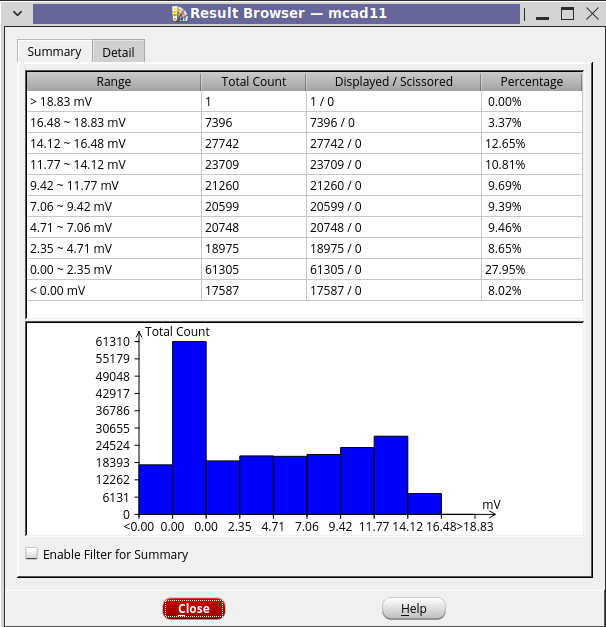
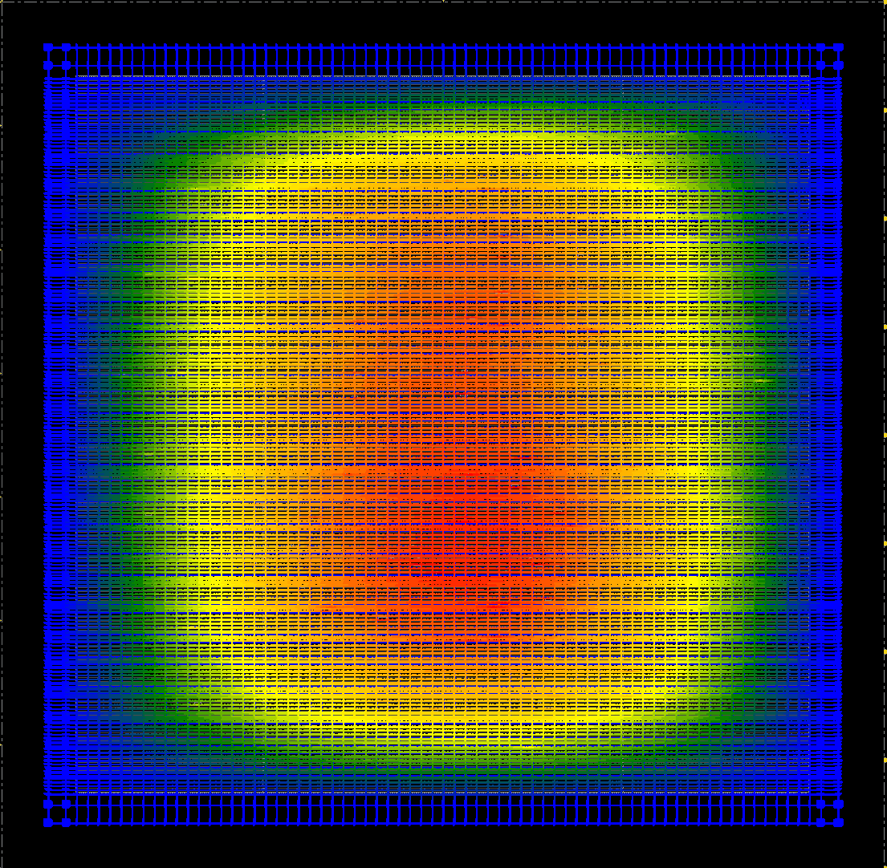

# DIC Final Project: FP_MUL

This repository contains the public 0.5 ns(2GHz) version of my Digital IC Design
final project. The project implements and verifies a IEEE-754 double-precision
floating-point multiplier (`FP_MUL`) and documents the synthesis/APR flow used
to target a high-frequency ASIC implementation.

本 repository 為 Digital IC Design final project 的公開版本，內容是
0.5 ns 目標時脈的雙精度浮點乘法器 (`FP_MUL`)。公開內容包含 RTL、
testbench、synthesis/APR 流程腳本、整理過的 synthesis 報告摘要，以及部分
實作成果截圖。

## Project Overview

`FP_MUL` receives two IEEE-754 double-precision floating-point operands through
an 8-bit serial input interface and returns the 64-bit multiplication result
through an 8-bit serial output interface. The design handles normal numbers,
subnormal numbers, zero, infinity, and NaN cases, with RTL simulation test
benches included in this public release.

This public version focuses on the 0.5 ns target clock implementation.

`FP_MUL` 透過 8-bit serial input interface 接收兩個 IEEE-754 double-precision
floating-point operands，並透過 8-bit serial output interface 回傳 64-bit
乘法結果。設計涵蓋 normal number、subnormal number、zero、infinity 與 NaN
等情況，並附上 RTL simulation testbench。

## Technology and Tools

- Process technology: TSMC ADFP N16
- RTL simulation: Cadence ncverilog
- Logic synthesis: Cadence Genus
- APR / physical implementation: Cadence Innovus
- Layout / physical verification related environment: Cadence Virtuoso

本專案使用 TSMC ADFP N16 製程；RTL simulation 使用 Cadence ncverilog，
logic synthesis 使用 Cadence Genus，APR / physical implementation 使用
Cadence Innovus，layout / physical verification 相關環境使用 Cadence
Virtuoso。

## Repository Contents

- `RTL/`: Verilog RTL and RTL-level test bench.
- `Synthesis/`: Public timing constraint and sanitized Cadence Genus synthesis Tcl flow.
- `Netlist/`: Gate/post-layout test bench files and simulation run files.
- `Innovus/`: Cadence Innovus APR command flow with process-specific values redacted.
- `0.5_ns_report/`: Sanitized synthesis report summaries.
- `DRC&LVS/`: Public note for private physical signoff material.

目錄說明：

- `RTL/`: Verilog RTL 與 RTL-level testbench。
- `Synthesis/`: timing constraint 與公開版 Cadence Genus synthesis Tcl flow。
- `Netlist/`: gate-level / post-layout simulation testbench 與 run files。
- `Innovus/`: Cadence Innovus APR command flow，製程相關參數已遮蔽。
- `0.5_ns_report/`: 已整理並去除敏感資訊的 synthesis report 摘要。
- `DRC&LVS/`: private physical signoff material 的公開說明。

## Public Metrics

- Target clock period: 0.5 ns
- Worst synthesis slack: +2 ps
- Cell count: 19542
- Total area: 12623.773

## Implementation Result Snapshots

| APR Result Browser | IR Drop |
| --- | --- |
|  |  |

## Confidentiality Notice

This repository intentionally does not publish confidential process collateral
or full physical implementation data. General Cadence command flow is kept, but
technology-dependent values are redacted with `<PRIVATE_...>` placeholders.

Redacted items include physical technology files, process setup values,
tap/endcap/filler/tie cell names, routing width/spacing/offset values,
stream-out map paths, physical-library GDS references, operating-corner details,
and full mapped timing paths.

The netlist run files keep the original referenced standard-cell model filename
for context, but the private model file itself is not included.

此公開版本保留一般 Cadence synthesis / APR / simulation flow，但不公開
foundry PDK、standard-cell library、routing rule、GDS stream-out map、
operating corner、完整 mapped timing path 等製程相關機密資訊。這些內容在
腳本中以 `<PRIVATE_...>` placeholder 表示。
